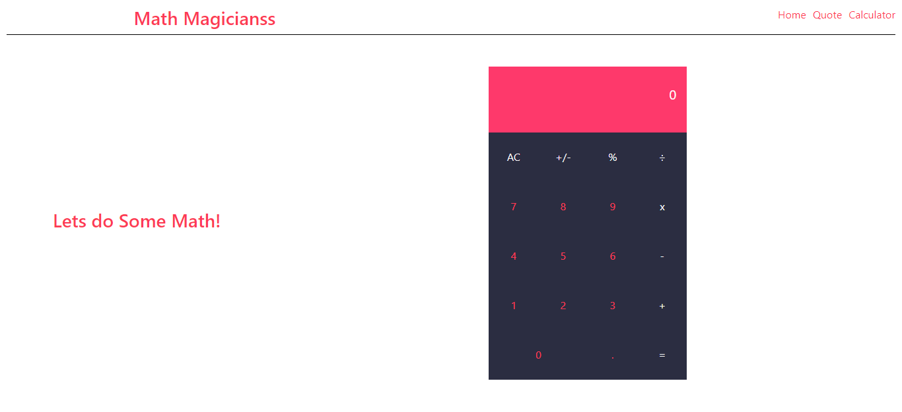

# Math Magicians

> "Math magicians" is a website for all fans of mathematics. It is a Single Page App (SPA) that allows users to: Make simple calculations. Read a random math-related quote.

## ScreenShots

## Built with

- React.js
- Bootstap

## Live Demo

Deployed to Github Pages:

[Github Pages](https://ahzia.github.io/Math-Magicians/)

[Heroku](https://mathmatic-magic.herokuapp.com/)

[Netlify](https://priceless-kowalevski-30ed02.netlify.app/)

## Getting Started

to use this repo please follow this steps : 

### Prerequisite
you need npm to install dependencies and run the project, if you don't already have it go to this link to install it in your machine [npm](https://docs.npmjs.com/downloading-and-installing-node-js-and-npm)

### Setup
- clone the repo : `https://github.com/ahzia/Math-Magicians.git`
- run `npm i`

### Usage
- run `npm start`
- Open Browser

👤 **Ahmad Zia Yousufi**
- GitHub: [@ahzia](https://github.com/ahzia)
- Twitter: [@ZiaYousofi](https://twitter.com/ZiaYousofi)
- LinkedIn: [Ahmad zia Yousufi](https://www.linkedin.com/in/ah-ziayosfi/)
## 🤝 Contributing

Contributions, issues, and feature requests are welcome!

Feel free to check the [issues page](../../issues/).

## Show your support

Give a ⭐️ if you like this project!

## 📝 License

This project is [MIT](./MIT.md) licensed.
